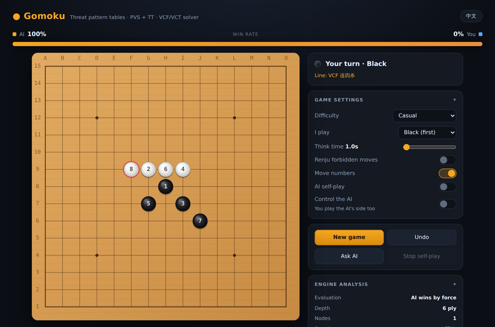

# Gomoku · 五子棋 AI

A single-file, zero-dependency Gomoku (five-in-a-row) engine and UI. One `index.html` —
open it and play. No build step, no packages, no server required.

**What makes it interesting is not the engine — it's the measurement harness.**
Every change to the engine had to survive a deterministic A/B match before it was allowed
into the code, and most of them didn't.



---

## Play

Open `index.html` in any modern browser. That's it.

For full engine strength, serve it over HTTP so the engine can run in a Web Worker
(browsers block Workers on `file://`, and the fallback caps each move at 3s):

```bash
python3 -m http.server 8000    # then open http://localhost:8000
```

---

## The engine

Roughly 700 lines of plain JavaScript, running in a Web Worker.

| Component | Approach |
|---|---|
| Evaluation | Incremental **threat pattern tables** — each of the 4 directions per cell is classified (open three, four, etc.) and updated on make/unmake rather than rescanned |
| Search | **PVS** (principal variation search) with iterative deepening, null-window re-search, late-move reduction, killer moves, history heuristic |
| Transposition | Zobrist hashing → 2²⁰-entry table with depth/flag/best-move, plus a separate 2²¹ table for VCT |
| Tactics | **VCF** (victory by continuous fours) and **VCT** (continuous threats — finds four-three and double-three wins) as exact solvers, not heuristics |
| Safety | Root-level *loss avoidance*: candidate moves are tested to see if the opponent has a forced win in reply |
| Rules | Optional Renju forbidden moves for Black (double-four, double-three, overline) |

Difficulty levels 1–5 scale time budget, depth, and which tactical solvers run.
Level 5 ("Nightmare") searches ~9s per move with full VCF/VCT and loss-avoidance.

### Why VCT needs care

VCT is an exact solver, so a bug makes it claim wins that don't exist. Two traps are
documented in the code:

- **Abort contamination.** `vct()` returns 0 both for "proved no win" and for "ran out of
  budget." Storing the latter as a refutation would permanently mark an unsearched position
  as safe — a silent missed defence. A global abort counter gates refutation writes.
- **Hash collisions.** A proof entry stores a move; a 21-bit index plus 32-bit checksum still
  collides. Since `think()` plays tactical results immediately with a near-win score, a
  collision would make the engine confidently play garbage. Proof hits are re-validated
  (`board[m] === EMPTY` and the move is actually a threat) before use.

---

## The measurement harness — and what it found

Everything in `scratchpad/` exists to answer one question honestly: *did that change
actually make it play better?*

### Determinism first

The engine is time-budgeted, so it is normally non-deterministic — the same position can
give different moves depending on machine load. That makes A/B results unreproducible.

`scratchpad/load.js` extracts the engine source from `index.html` and swaps
`nowMs()` for a **virtual clock driven by a node counter**. Every timeout check in the
engine then becomes deterministic, without touching the 12%/28%/45% budget logic. Same
position in, same move out, byte for byte — and matches can run in parallel without CPU
contention affecting results.

`det.js` asserts this: play the same game twice, the move lists must be identical.

### Two hard rules

1. **Run a same-engine control before every A/B. It must come out 6:6.** Anything else means
   there is still a hidden source of randomness and the results are worthless.
2. **The configuration under test must match the shipped `LEVELS` values field for field.**
   Violating this once produced a "+90 Elo" result for an engine configuration that does not
   exist in the product.

### Results

| Change | Result | Verdict |
|---|---|---|
| Fix a real bug in the root-filter fallback | 6 : 6 (12 games) | Real bug, no measurable effect |
| Disable root filtering entirely | 23 : 25 (48 games) | Neutral |
| Keep the transposition table across moves | 22 : 26 (48 games) | Slightly negative |
| **Transposition table for VCT** | LV3 24:24, LV4 9:15, LV5 11:12 | Neutral overall |
| **Re-sort root moves each iteration** | 26 : 21 + 1 draw (48 games) = **0.73σ** | Not demonstrated |

**Net measured strength gain across all of it: zero.**

That result is the point. Each change was a genuine defect or a textbook improvement:
`sortRoot()` really was never called during iterative deepening; the VCT transposition rate
really was 86%; instrumentation confirmed the fixes did what they claimed (one extra ply of
search, better time-budget utilisation). None of it converted into measurable playing
strength.

The most instructive episode: the VCT transposition table won 15:9 at level 4, was declared a
gain, and was merged. Testing it at level 5 — a structurally identical configuration where the
proposed mechanism predicted a *larger* gain — came out neutral. The level-4 result was noise
at 1.22σ, and the mechanism story had been invented after seeing the number. It was retracted.
Later, root re-sorting produced 26:21 — a weaker 0.73σ — and was rejected under the same
standard rather than accepted because it pointed the right way.

Full write-up, including the reasoning that was wrong and why, is in
[`PROGRESS.md`](PROGRESS.md).

---

## Repository layout

```
index.html            the whole product — engine + UI, no dependencies
PROGRESS.md           engineering log: what was tried, measured, kept, retracted
scratchpad/
  load.js             extracts the engine, injects the virtual clock, builds variants
  game.js             headless match runner
  det.js              determinism self-check (must be byte-identical)
  probe_tt.js         transposition-rate measurement
  ab_*.js             A/B matches (ab_lv5.js runs multi-arm, in parallel)
  ab_worker.js        child process for parallel matches
docs/screenshot.png
```

Run an experiment:

```bash
cd scratchpad
node det.js                                    # determinism must hold first
node ab_lv5.js --arms=rootsort --openings=24   # control + A/B, uses all cores
```

`load.js` verifies the engine source against the exact text it expects and **fails loudly if
`index.html` changed** — so an experiment can never silently test stale code.

---

## UI

- Board with coordinates, move numbers, last-move marker, win-line highlight
- Live win-rate bar (logistic on the engine score; the constant was least-squares fitted to
  296 samples from self-play, because the hand-picked one was badly overconfident)
- Engine analysis panel: evaluation, depth, nodes, speed, principal variation
- Undo, hint, AI self-play, and a "control the AI" mode where you play both sides
- English / Chinese toggle, responsive down to phone screens, keyboard shortcuts

## License

MIT — see [LICENSE](LICENSE).
